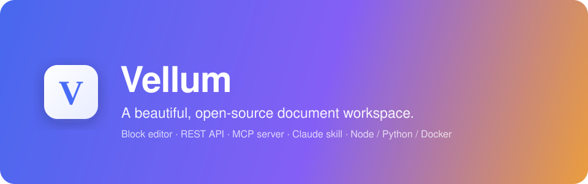

<p align="center">
  
</p>

<h1 align="center">Vellum</h1>

<p align="center">
  <b>A beautiful, open-source document workspace — a self-hostable homage to <a href="https://www.craft.do">Craft</a>.</b><br/>
  Block editor · REST API · MCP server · Claude skill · runs on Node, Python, or Docker.
</p>

<p align="center">
  
  
  
  
</p>

---

Vellum is a clean, card-based writing app with a Notion-style block editor and Craft's
warm, tactile aesthetic. It's tiny, has **zero runtime dependencies**, and everything a
document can do is reachable through a clean **REST API**, a bundled **MCP server**, and a
**Claude skill** — so you (or an AI agent) can automate your knowledge base.

## ✨ Features

- **Block editor** — headings, to-dos, bulleted & numbered lists, quotes, callouts, code, dividers.
- **Slash menu** — press `/` to insert any block; fuzzy-filter by name or keyword (`/todo`, `/task`, `/h1`).
- **Markdown shortcuts** — `# `, `## `, `- `, `[] `, `> `, ` ``` ` auto-convert as you type.
- **Tasks** — a real task manager with **Inbox / Today / Upcoming / All** views, inline editing, and scheduling.
- **Calendar** — a scrollable day-by-day agenda with *Today* highlighted; add tasks straight onto any day.
- **Folders & documents** — organize work into folders, browse as cards (with live previews) or a list.
- **Faithful Craft-style design** — clean line icons (no emoji chrome), calm dark + light themes, rounded
  cards, soft shadows, elegant typography.
- **Instant search** across every document's title and content.
- **Offline-first web client** — works straight from disk using `localStorage`, and upgrades to the
  live API automatically when a server is running.
- **Two interchangeable backends** — Node and Python speak the same REST API and share the same data file.
- **Automation-ready** — REST API + MCP server (13 tools) + Claude skill, all documented below.

## 🚀 Quick start

Pick whichever runtime you have. All three serve the **same app** at **http://localhost:4321**.

### Node (zero install)

```bash
cd server-node
node src/index.js
```

### Python (zero install, stdlib only)

```bash
cd server-python
python main.py
```

### Docker

```bash
docker compose up
# → http://localhost:4321  (documents persist in the `vellum-data` volume)
```

> No build step, no `npm install`, no `pip install`. The data lives in a single
> `vellum-data.json` file (override the location with the `VELLUM_DB` env var).

## 🧩 REST API

Base URL: `http://localhost:4321/api` · every response is `{ "ok": true, "data": ... }`.

| Method | Endpoint | Description |
|--------|----------|-------------|
| `GET` | `/health` | Liveness check |
| `GET` | `/spaces` | List spaces |
| `POST` | `/spaces` | Create a space `{ name, emoji?, color? }` |
| `PATCH` | `/spaces/:id` | Update a space |
| `DELETE` | `/spaces/:id` | Delete a space (and its documents) |
| `GET` | `/documents?spaceId=` | List documents (optionally by space) |
| `POST` | `/documents` | Create `{ spaceId, title, emoji?, content? }` |
| `GET` | `/documents/:id` | Get one document with full content |
| `PATCH` | `/documents/:id` | Update `{ title?, emoji?, content? }` |
| `POST` | `/documents/:id/blocks` | Append `{ blocks: [...] }` |
| `POST` | `/documents/:id/restore` | Restore from trash |
| `DELETE` | `/documents/:id` | Trash (`?hard=true` to purge) |
| `GET` | `/search?q=` | Full-text search |
| `GET` | `/tasks?filter=` | List tasks (`inbox` / `today` / `upcoming` / `all`), or `?day=<ms>` for one day |
| `POST` | `/tasks` | Create `{ title, due? }` (`due` = epoch ms; omit for Inbox) |
| `PATCH` | `/tasks/:id` | Update `{ title?, done?, due? }` |
| `DELETE` | `/tasks/:id` | Delete a task |

**A block** is `{ "type": "...", "text": "...", "checked?": bool }`.
Types: `text`, `h1`, `h2`, `h3`, `todo`, `bullet`, `numbered`, `quote`, `code`, `callout`, `divider`.

```bash
# Create a document
curl -X POST http://localhost:4321/api/documents \
  -H 'Content-Type: application/json' \
  -d '{
    "spaceId": "<space-id>",
    "title": "Launch plan",
    "emoji": "🚀",
    "content": [
      { "type": "h1", "text": "Launch plan" },
      { "type": "todo", "text": "Write the README", "checked": true },
      { "type": "callout", "text": "Ship on Friday." }
    ]
  }'
```

## 🤖 MCP server

Vellum ships a **zero-dependency Model Context Protocol server** that exposes the API as
tools any MCP client (Claude Desktop, Claude Code, etc.) can call.

Add it to your MCP config (see [`.mcp.json`](.mcp.json)):

```json
{
  "mcpServers": {
    "vellum": {
      "command": "node",
      "args": ["/absolute/path/to/vellum/mcp-server/index.js"],
      "env": { "VELLUM_URL": "http://localhost:4321" }
    }
  }
}
```

Tools: `list_spaces`, `create_space`, `list_documents`, `get_document`, `create_document`,
`update_document`, `append_blocks`, `search_documents`, `delete_document`,
`list_tasks`, `create_task`, `update_task`, `delete_task`.

Then just ask: *"Add a to-do to my Launch plan doc in Vellum"* and Claude will call the tools.

## 🧠 Claude skill

The [`skill/vellum`](skill/vellum) folder is a ready-to-use
[Agent Skill](https://docs.claude.com/en/docs/claude-code/skills). Copy it into your
`~/.claude/skills/` (or a project's `.claude/skills/`) directory and Claude will know how
to create, edit, and search Vellum documents on request — via the MCP tools or plain `curl`.

## 🗂️ Project structure

```
vellum/
├── web/                # Vanilla-JS block editor (no build step)
│   ├── index.html
│   ├── styles.css      # craft-style theming (light + dark)
│   └── app.js          # editor, slash menu, REST client + localStorage fallback
├── server-node/        # Zero-dependency Node REST API + static host
│   └── src/{index.js, db.js}
├── server-python/      # Zero-dependency Python (stdlib) REST API + static host
│   └── main.py
├── mcp-server/         # Zero-dependency MCP server (stdio JSON-RPC)
│   └── index.js
├── skill/vellum/       # Claude Agent Skill
├── Dockerfile          # Node runtime image
├── Dockerfile.python   # Python runtime image
└── docker-compose.yml
```

## 🎨 Design tokens

The palette lives in CSS variables at the top of [`web/styles.css`](web/styles.css) — accent
`#4a6cf7`, warm-paper background, soft shadows, serif quotes. Tweak once, restyle everywhere.

## 🛣️ Roadmap

- [x] Tasks with Inbox / Today / Upcoming views
- [x] Calendar agenda view
- [ ] Nested / sub-page documents in the sidebar tree
- [ ] Drag-to-reorder blocks
- [ ] Inline formatting (bold / italic / links) toolbar
- [ ] Image & file blocks with upload
- [ ] Real-time collaboration
- [ ] Export to Markdown / PDF

## 🙏 Acknowledgements

Design inspired by [Craft](https://www.craft.do). Vellum is an independent, unaffiliated,
open-source project built for self-hosting and learning.

## 📄 License

[MIT](LICENSE) © 2026
